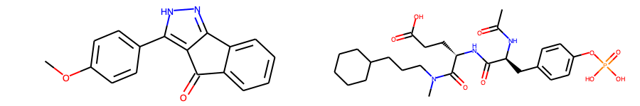
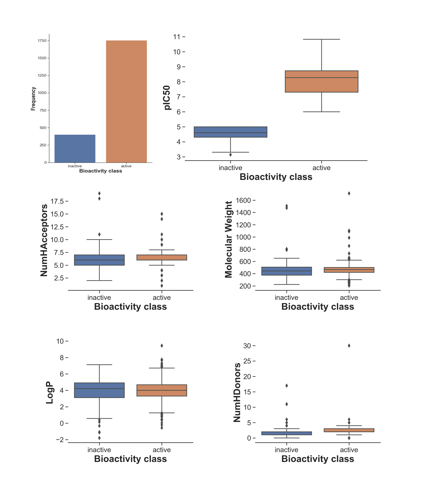
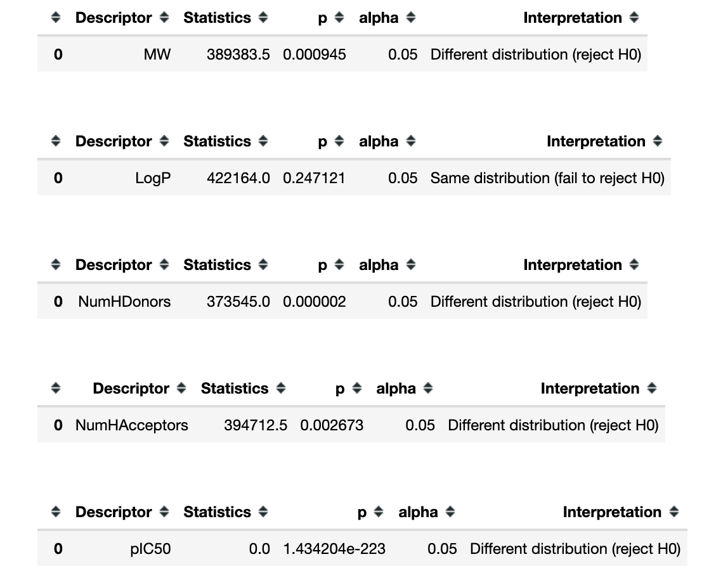

# Goal and Description

This project deals with classifying the effectiveness of the drug based on Lipinski molecular descriptors.
The target protein is **Tyrosine ABL kinase**. Mutations in the ABL-kinase are associated with **chronic myelogenous leukemia (CML)**. 
This is binary classification problem, where features **(X)** are Lipinski molecular descriptors. The target vector **(y)** for 
classification is bioactivity of the drug, which is either `active` or `inactive`. 

# Data collection
Data is obtained from the [ChEMBL Database](https://www.ebi.ac.uk/chembl/). The [ChEMBL Database](https://www.ebi.ac.uk/chembl/) is a database that contains curated bioactivity data of more than 2 million compounds. It is compiled from more than 76,000 documents, 1.2 million assays and the data spans 13,000 targets and 1,800 cells and 33,000 indications.
[Data as of March 25, 2020; ChEMBL version 26].

# Data Preprocessing 

## Feature Engineering

The features (i.e. Lipinski molecular descriptors) were generated from the smiles obtained the **ChEMBL Database**.
**Lipinski's rule** states that, in general, an orally active drug has no more than one violation of the **following criteria**:

* No more than 5 hydrogen bond donors (the total number of nitrogen–hydrogen and oxygen–hydrogen bonds)
* No more than 10 hydrogen bond acceptors (all nitrogen or oxygen atoms)
* A molecular mass less than 500 daltons
* An octanol-water partition coefficient (log P) that does not exceed 5

## Labeling compounds/drugs as either being active, inactive or intermediate
The bioactivity data is in the IC50 unit. Compounds having values of less than 1000 nM will be considered to be **active** while those greater than 10,000 nM will be considered to be **inactive**. As for those values in between 1,000 and 10,000 nM will be referred to as **intermediate**. 

# Exploratory data Analysis (EDA)

## Statistical analysis | Mann-Whitney U Test

All of the 4 Lipinski's descriptors exhibited ***statistically significant difference*** between the **actives** and **inactives**.

